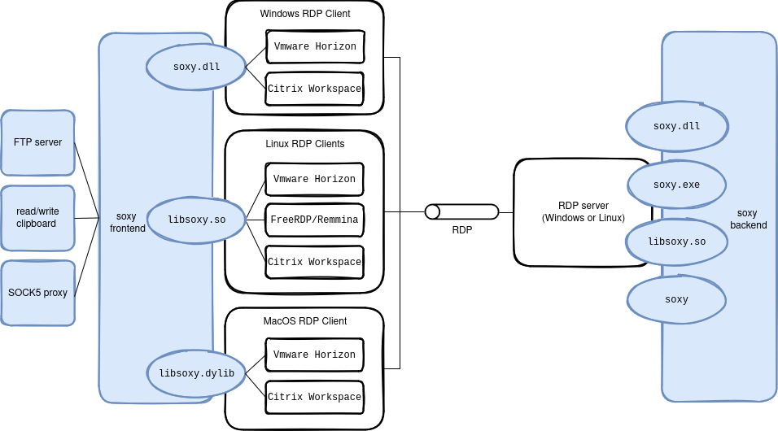

# soxy

[](https://github.com/airbus-seclab/soxy/actions/workflows/clippy.yml)
[](https://github.com/airbus-seclab/soxy/actions/workflows/build.yml)

soxy is a modular tool to interact with several VDIs that operate over RDP,
such as VMware Horizon, Citrix, native Windows RDP and XRDP. It supports useful
debug services (e.g. clipboard, console/shell, sharing, FTP server, SOCKS5 proxy).

## 🎯 Features

soxy has a frontend and a backend component. The latter executes inside a
Windows instance managed by one of the supported VDIs, while the frontend
bridges access to backend functions by exposing VDI-side resources locally using
a common protocol. At the time of writing, soxy provides:

- a telnet interface to inject keystrokes ("input");
- a bootstrap module using a PowerShell backend script ("stage0");
- a (basic) FTP server to access the remote machine's filesystem;
- a telnet interface to spawn and interact with a console/shell executed on
  the remote machine;
- a telnet interface to read/write the clipboard of the remote
  machine;
- a SOCKS5 proxy which permits to open connections on client's side as if it was
  opened in the remote machine.

soxy is a more stable, complete and modular alternative to existing tools such
as [SocksOverRDP](https://github.com/nccgroup/SocksOverRDP),
[ica2TCP](https://github.com/synacktiv/ica2tcp), and
[rdp2tcp](https://rdp2tcp.sourceforge.net).

soxy supports native Windows RDP (real or virtual host) as well as VMware
Horizon, Citrix virtual machines and XRDP.

On the client side, soxy works as a plugin on:

- VMware Horizon client on Linux, macOS and Windows;
- FreeRDP and Remmina on Linux;
- Citrix client on Linux, macOS and Windows.

On the remote host, soxy can run as a standalone Windows executable or can be
embedded in other applications as a DLL. In release mode, this part of soxy is
kept as small as possible.
It is built without any logging related
code (even log message strings are absent from the binary) and without symbols.




## Table of Contents

- [Project Architecture](#-project-architecture)
- [Getting Started](#-getting-started)
  - [Build](#-build)
  - [Frontend Installation](#-frontend-installation)
  - [Backend Installation](#-backend-installation)
- [Usage](#-usage)
- [Troubleshooting](#-troubleshooting)
- [Contributing](#-contributing)
- [License](#-license)


## 📁 Project Architecture

The soxy source code is split into four parts:

- **frontend**: contains the code of the dynamic library to be installed on the
  client's machine and loaded by FreeRDP (or Remmina), VMware Horizon viewer, or
  Citrix. This part of soxy accepts TCP connections on the client's side (or
  local network, depending on the configuration) for each service;
- **backend**: contains the code of the Windows executable
  (or DLL) to be launched (or loaded) on the remote Windows machine;
- **soxyreg**: contains the code to produce an executable that
  simplifies the (un)installation of the `frontend` on Windows by
  inserting/deleting the appropriate registry keys;
- **standalone**: contains the code to produce an executable including both the
  `frontend` and the `backend` parts (with an emulated RDP channel) for testing
  implementations of services;
- **common**: contains some code used by all other parts.

All communications between the `frontend` and the `backend` go through
a single [Static Virtual Channel](https://learn.microsoft.com/en-us/openspecs/windows_protocols/ms-rdpbcgr/343e4888-4c48-4054-b0e3-4e0762d1993c)
or a single [Dynamic Virtual Channel](https://learn.microsoft.com/en-us/windows/win32/termserv/dynamic-virtual-channels)
of the RDP protocol. A single FIFO is used to transmit from/to the `frontend`
to/from `backend`, which means that there is no priority levels between services
within soxy.

**Note**: There is no rate limiting feature implemented in soxy. Under heavy
load, other channels (i.e. keyboard, mouse, display, USB, ...) can be slowed
down, depending on the underlying implementation (Windows native RDP, VMware
Horizon, Citrix).


## 🚀 Getting Started

### 🔨 Build

#### Pre-compiled Binaries

Pre-compiled binaries can be found in the
[Releases](https://github.com/airbus-seclab/soxy/releases) section of the
project on Github. The build step can be skipped, and these binaries may be used
as described in the next sections.

#### On Linux

All Linux and Windows libraries and executables of soxy can be built on Linux.


##### Requirements

The following elements are required to build them:

- `make`;
- `clang`;
- `mingw-w64` package on Arch, Debian and Ubuntu, `mingw64-gcc` and
  `mingw32-gcc` on Fedora (to build Windows binaries);
- `gcc-multilib` on Debian and Ubuntu to but i686 Linux binaries;
- [rustup](https://rustup.rs/) installed (see next section).

##### Included services

By default both Static and Dynamic Virtual Channels are supported and
enabled in the ̀`Makefile`. It is possible to build `soxy` with the
support of a Static/Dynamic Virtual Channel only by editing
the `VC` variable at the beginning of the `Makefile`.

```Makefile
VC ?= dvc svc
```

By default all services are enabled in the `Makefile`. It is possible
to include services needed only by editing the `SERVICES`
variable at the beginning of the `Makefile`.

```Makefile
SERVICES ?= clipboard command ftp input socks5 stage0
```

##### Make Targets

By default all supported platforms (except macOS ones) are enabled in
the `Makefile`. It is possible to enable only the build of artifcats needed
by editing the three following variables at the beginning of the `Makefile`.

```Makefile
TARGETS_FRONTEND ?= i686-pc-windows-gnu x86_64-pc-windows-gnu i686-unknown-linux-gnu x86_64-unknown-linux-gnu
TARGETS_BACKEND ?= i686-pc-windows-gnu x86_64-pc-windows-gnu i686-unknown-linux-gnu x86_64-unknown-linux-gnu
TARGETS_STANDALONE ?= i686-pc-windows-gnu x86_64-pc-windows-gnu i686-unknown-linux-gnu x86_64-unknown-linux-gnu
TARGETS_SOXYREG ?= i686-pc-windows-gnu x86_64-pc-windows-gnu
```

It is also possible to override all default enabled parameters from the command line, e.g.:

```bash
VC=dvc SERVICES=socks5 TARGETS_FRONTEND=x86_64-unknown-linux-gnu TARGETS_BACKEND=x86_64-pc-windows-gnu TARGETS_STANDALONE= TARGETS_SOXYREG=x86_64-pc-windows-gnu make debug
```

The `Makefile` contains three main targets:

- `setup`: invokes `rustup` to install all needed toolchains, targets and
  components for Rust;
- `debug`: builds non-stripped libraries and executables with debugging logs
  activated. Outputs to a repository named `debug`;
- `release`: builds stripped and optimized libraries and executables with
  informational logs for the frontend libraries and standalone binaries, but
  without any logs for the backend libraries and binaries. Outputs to a
  repository named `release`.
  
The output hierarchy of the created repositories is the following:

```
├── backend
│   ├── i686-pc-windows-gnu
│   │   ├── soxy.dll
│   │   └── soxy.exe
│   ├── i686-unknown-linux-gnu
│   │   ├── libsoxy.so
│   │   └── soxy
│   ├── x86_64-pc-windows-gnu
│   │   ├── soxy.dll
│   │   └── soxy.exe
│   └── x86_64-unknown-linux-gnu
│       ├── libsoxy.so
│       └── soxy
├── frontend
│   ├── i686-pc-windows-gnu
│   │   └── soxy.dll
│   ├── i686-unknown-linux-gnu
│   │   └── libsoxy.so
│   ├── x86_64-pc-windows-gnu
│   │   └── soxy.dll
│   └── x86_64-unknown-linux-gnu
│       └── libsoxy.so
└── soxyreg
│   ├── i686-pc-windows-gnu
│   │   └── soxyreg.exe
│   ├── x86_64-pc-windows-gnu
│       └── soxyreg.exe
└── standalone
    ├── i686-pc-windows-gnu
    │   └── soxy_standalone.exe
    ├── i686-unknown-linux-gnu
    │   └── soxy_standalone
    ├── x86_64-pc-windows-gnu
    │   └── soxy_standalone.exe
    └── x86_64-unknown-linux-gnu
        └── soxy_standalone
```

#### On macOS

Only the frontend can be built on macOS. Proceed as follows.

For the debug version:

```bash
cd frontend
cargo build --features log
```

For the release version:

```bash
cd frontend
cargo build --release
```

This produces `target/debug/libsoxy.dylib` or `target/release/libsoxy.dylib`
installable as described in the next section.

### 🔌 Frontend Installation

#### For VMware Horizon Client and Windows native RDP client

##### On macOS

Copy `libsoxy.dylib` to `/Applications/VMware Horizon Client.app/Contents/Library/pcoip/vchan_plugins/rdpvcbridge/`.

##### On Linux

Copy the frontend library into the VMware `rdpvcbridge` directory:

```bash
sudo cp release/frontend/x86_64-unknown-linux-gnu/libsoxy.so /usr/lib/vmware/rdpvcbridge/
```

**Note**: on recent versions of VMware Horizon client, the directory has moved
to `/usr/lib/omnissa/rdpvcbridge/`.

##### On Windows

Register the `frontend` library for automatic loading by VMware
Horizon client. It is mandatory to use the same architecture version
(*i.e.* 32/64 bit version from
`i686-pc-windows-gnu`/x86_64-pc-windows-gnu) of `soxyreg.exe` than for
`soxy.dll`?

To use a Static Virtual Channel:

```bash
soxyreg.exe svc register soxy.dll
```

(x)or to use a Dynamic Virtual Channel:

```bash
soxyreg.exe dvc register soxy.dll
```

To uninstall the Static Virtual Channel:

```bash
soxyreg.exe svc unregister
```

(x)or to uninstall the Dynamic Virtual Channel:

```bash
soxyreg.exe dvc unregister
```


#### For FreeRDP and Remmina (Linux)

Create the FreeRDP plugin directory and copy the library to it. Be careful, the
name of the library **must** be `libsoxy-client.so` (not `libsoxy.so`) otherwise
the library will not be found by FreeRDP/Remmina:

* for FreeRDP 2 on Arch:

  ```bash
  sudo mkdir -p /usr/lib/freerdp2
  sudo cp release/frontend/x86_64-unknown-linux-gnu/libsoxy.so /usr/lib/freerdp2/libsoxy-client.so
  ```

* for FreeRDP 2 on Debian/Ubuntu:

  ```bash
  sudo mkdir -p /usr/lib/x86_64-linux-gnu/freerdp2
  sudo cp release/frontend/x86_64-unknown-linux-gnu/libsoxy.so /usr/lib/x86_64-linux-gnu/freerdp2/libsoxy-client.so
  ```

* for FreeRDP 3 on Arch:

  ```bash
  sudo mkdir -p /usr/lib/freerdp3
  sudo cp release/frontend/x86_64-unknown-linux-gnu/libsoxy.so /usr/lib/freerdp3/libsoxy-client.so
  ```

* for FreeRDP 3 on Debian/Ubuntu:

  ```bash
  sudo mkdir -p /usr/lib/x86_64-linux-gnu/freerdp3
  sudo cp release/frontend/x86_64-unknown-linux-gnu/libsoxy.so /usr/lib/x86_64-linux-gnu/freerdp3/libsoxy-client.so
  ```

When you launch FreeRDP from the command line, you have to add the argument
`/vc:soxy` to tell FreeRDP to load the library and to use a Static Virtual Channel,
(x)or `/dvc:soxy` to use a Dynamic Virtual Channel, for example:

* for FreeRDP 2 with a Static Virtual Channel:

  ```bash
  xfreerdp /dynamic-resolution /log-level:INFO /v:192.168.42.42 /vc:soxy
  ```

or with Dynamic Virtual Channel:

  ```bash
  xfreerdp /dynamic-resolution /log-level:INFO /v:192.168.42.42 /dvc:soxy
  ```

* for FreeRDP 3 with a Static Virtual Channel:

  ```bash
  sdl-freerdp3 /dynamic-resolution /log-level:INFO /v:192.168.42.42 /vc:soxy
  ```

or with Dynamic Virtual Channel:

  ```bash
  sdl-freerdp3 /dynamic-resolution /log-level:INFO /v:192.168.42.42 /dvc:soxy
  ```

For Remmina, edit your RDP connection, go to the "Advanced" tab and set the
"Static virtual channel" (x)or "Dynamic virtual channel" parameter to `soxy`.

#### For Citrix Workspace App

##### On macOS

_TODO_

##### On Linux

First copy `libsoxy.so` to `/opt/Citrix/ICAClient/`, then modify
`/opt/Citrix/ICAClient/config/module.ini`:

- add `soxy` in the `VirtualDriver` list in the `[ICA 3.0]` section
- in the same section, add the line `soxy=On`
- add a `[soxy]` section containing the following line:
  - `DriverName = libsoxy.so`

Be careful, **only Static Virtual Channels** are supported in the Citrix
Linux client.

##### On Windows

First **you must copy** the **32 bits version** of `soxy.dll` from
`i686-pc-windows-gnu` to `C:\Program Files (x86)\Citrix\ICA Client`,
then register it with the **32 bits version** of `soxyreg` for
automatic loading by Citrix Workspace App; you need to run the command
with administrator privileges.

To use a Static Virtual Channel:

```bash
i686-pc-windows-gnu\soxyreg.exe svc register soxy.dll
```

(x)or to use a Dynamic Virtual Channel:

```bash
i686-pc-windows-gnu\soxyreg.exe dvc register soxy.dll
```

To uninstall the Static Virtual Channel:

```bash
i686-pc-windows-gnu\soxyreg.exe svc unregister
```

and to uninstall the Dynamic Virtual Channel:

```bash
i686-pc-windows-gnu\soxyreg.exe dvc unregister
```


#### Configuration file

When the `frontend` of soxy starts, it will look for a configuration
file at `$HOME/.config/soxy.toml` on Linux and macOS and at
`{FOLDERID_Profile}/soxy.toml` on Windows. If no configuration file is
found, it will be created with default values. Here is a complete
example of configuration file:

```toml
#Default virtual channel name.
channel = "SOXY"

#Default listen address for services. It can be overridden per service.
#Use "::1" to listen both on IPv4 and IPv6 on localhost.
#Use "::0" to listen both on IPv4 and IPv6 on all interfaces.
#Default value is "127.0.0.1".
ip = "127.0.0.1"

[log]
#Logging level: "OFF" or "ERROR" or "WARN" or "INFO" or "DEBUG" or "TRACE".
#Default value is "DEBUG" in debug targets and "INFO" in release targets.
level = "DEBUG"

#Default is to enable all available services on the global listen IP
#address and default ports.

[[services]]
name = "clipboard"
enabled = true
port = 3032

[[services]]
name = "command"
enabled = true
port = 3031

[[services]]
name = "ftp"
enabled = true
port = 2021

[[services]]
name = "input"
enabled = true
port = 1081

[[services]]
name = "socks5"
enabled = true
#Override the listen address of this service only
ip = "::0"
port = 1080

[[services]]
name = "stage0"
#Disable this service
enabled = false
port = 1082
```


### 🔌 Backend Installation

#### Using `soxy.exe`

Copy `release/x86_64-pc-windows-gnu/soxy.exe` to the Windows machine
you are connected to and execute it. On a Linux remote machine, use
`release/x86_64-unknown-linux-gnu/soxy`. You can override the default
virtual channel name (*i.e.* `SOXY`) by giving it as first and single
argument on the command line, e.g.:

```bash
soxy.exe MYCHAN
```

The virtual channel name is at most 7 ASCII characters.

#### (Alternative) Using the DLL/.so

Copy `release/x86_64-pc-windows-gnu/soxy.dll` and _find your way to
load the DLL_. For example, this can be done
thanks to `rundll32.exe` present on Windows with the following
command:

```bash
rundll32.exe soxy.dll,Main
```

The `Main` function executed by the above command is a simple infinite sleeping
loop, avoiding `rundll32.exe` from exiting, while the real work of soxy runs in
threads launched at loading time by the `DllMain` function present in the DLL.
If the DLL is loaded by a real binary/application, soxy will remain active until
the binary/application exits; you do not have to execute anything in the
library, everything will be done automatically at loading time.


## 💻 Usage

After setting up the client and running the backend, you can use the following
services.

### Accessing Services

As soon as your favorite client is set up and the _backend_ code is running,
you can start using soxy services from your client machine

#### Remote Clipboard

Connect to `localhost:3032` on your client machine with a telnet command,
and use the available commands:

- `write xxxx` or `put xxxx`: sets the remote clipboard to the value `xxxx`;
- `read` or `get`: retrieves the content of the remote clipboard;
- `exit` or `quit`: closes the connection.

#### Remote Console/Shell

Connect to `localhost:3031` on your client machine with a telnet command,
and use the available commands.

#### Remote Filesystem

Connect to `localhost:2021` on your client machine with your favorite FTP client
to browse, upload, download files and directories accessible to the backend
user.

#### Input

Connect to `localhost:1081` on your client machine with a telnet
command, and use one of the available commands below to
send input events. This service does not require a running backend,
only a loaded frontend.

- `delay <delay>` where `<delay>` is a integer representing an amount
  of time in milliseconds: sets the default delay between two input
  events;
- `pause <delay>` where `<delay>` is a integer representing an amount
  of time in milliseconds: waits the given amount of time before
  sending the next input event;
- `keydown <key>` where `<key>` in a supported keyword associated to a
  keyboard key (see `common/src/input/frontend.rs` for available
  keywords): presses the given keyboard key until the corresponding
  `keyup <key>` command is emitted;
- `key <key>` where `<key>` in a supported keyword associated to a
  keyboard key (see `common/src/input/frontend.rs` for available
  keywords): emulates the given key stroke (i.e. pressed then released);
- `write <input>` (resp. `writeln <input>`) where `<input>` a
  newline-terminated string: emulates the typing of the given text
  input on the keyboard (resp. including a carriage return at the
  end);
- `cat <file path>` where `<file path>` is a path to a "text" file:
  emulates the typing of the content of the given file on the keyboard;
- `exit` to quit the session.

In practice, the `cat` command permits to type the content of the
`tools/stage0/stage0.ps1` script on a remote machine where the soxy
backend is not yet deployed, and then to use the Stage0 service of
soxy to transfer the `soxy.exe` (or `soxy.dll`) backend.

#### SOCKS5 Proxy

Configure on your client machine to use `localhost:1080` as a SOCKS5 proxy.
Connections will originate from the remote host.

#### Stage0

Execute the script `stage0.ps1` (which can be found in `tools/stage0`) on the remote machine:
```powershell
powershell.exe -ExecutionPolicy Bypass -file stage0.ps1
```

Connect to `localhost:1082` on your client machine with a telnet command,
and use the available commands:

- `send <file path>`: sends the content of the file at the provided
  path, it will be stored in a file named `favicon.iso` in the
  directory where the previous script has been launched;
- `exit` to quit the session.

## Troubleshooting

### Citrix

If you get an error like `failed to open channel handle: virtual channel open failed (last_error = 5)`
it means there are restrictions on Citrix host virtual channels (default behavior
in last Citrix version). To fix this, if you have (local) administrator privileges,
you can disable Citrix restrictions on virtual channels (which is not recommended):

```powershell
reg add HKLM\SOFTWARE\WOW6432Node\Policies\Citrix\VCPolicies /v VirtualChannelWhiteList /t REG_MULTI_SZ /d =disabled=
```

Or you can whitelist `SOXY` (or your custom virtual channel name) like
this if you have (local) administrator privileges:

```powershell
reg add HKLM\SOFTWARE\WOW6432Node\Policies\Citrix\VCPolicies /v VirtualChannelWhiteList /t REG_MULTI_SZ /d SOXY,C:\Users\<USER>\<PATH_TO_SOXY_EXE>
```

Note that in both cases, you have to reboot the Citrix host afterward.

### XRDP

If you get an error like `failed to open channel handle: virtual channel open failed`
it  means there are restrictions on XRDP host virtual channels. To fix this,
if you have (local) administrator privileges, you can disable XRDP restrictions
for this very specific virtual channel. Edit `/etc/xrdp/xrdp.ini`, look for `[Channels]`
entry and add below `SOXY=true`.

The `backend` needs to be able to load `libxrdpapi.so` from the library path.
On most Linux distributions, it is not by default. You can add it on the
command line, e.g. for `x86_64` on Debian:

```bash
LD_LIBRARY_PATH=/usr/lib/x86_64-linux-gnu/ soxy
```

## 🚧 Contributing

Adding a new service (let's called it `ping`) in soxy requires to develop a new
module in the `common` directory and to instantiate it in both the `frontend`
and the `backend`.

### Steps

1. Create a new module structure:

```
common/src/ping/
├── backend.rs
├── frontend.rs
└── mod.rs
```

2. Declare the new module in `common/src/lib.rs`: `mod ping`;

3. Instanciate a `service::Service` in `static const SERVICE` in
   `common/src/ping/mod.rs`;

4. Update `common/src/service.rs`:
   - Import the `ping` module,
   - Add `&ping::SERVICE` to the `SERVICES` array at the end of the
     file.
   
Refer to `common/src/clipboard/` for an example.


## 🏢 License

This project is licensed under the GNU GPLv3 License. See the [LICENSE](LICENSE)
file for details.
